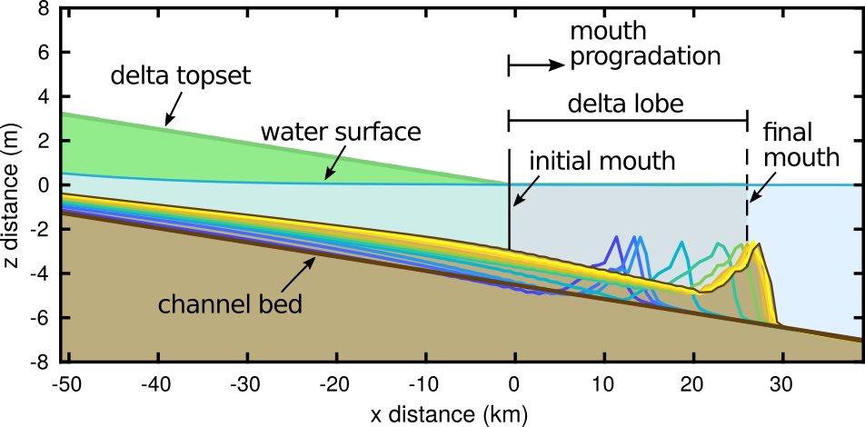

This file provides documentation to the wrapper used to explore the model develop​ed in "Modeling deltaic lobe-building cycles and avulsions of the Yellow River delta, China" (Moodie et al., in prep). See manuscript for a complete description of the model framework and parameterization. _Documentation for specific portions of the model code is included as line comments throughout the source code._



## Manuscript
The manuscript detailing this model was published in JGR in 2019:
```
reference to go here
```

A preprint of the manuscript and supplement is available [UPDATE ME](here).

## Model
The model (everything included under the `model` folder in this root directory) is split across many functions.
These functions are organized together into categories below the `model/source` folder.
Each of the function calls are made through the main model function `virtualdelta`. 
A call to the model wrapper looks like this:

```
[s] = virtualdelta(cfg);
```

where `cfg` is the configuration structure, explained below.
The model wrapper is typically called by a "case" script (see `/model/scripts`), which will 1) set up the configuration structure `cfg`, and 2) call the model through the wrapper.

The bulk of the configuration structure is initialized with a call to a "system initializer", such as `[cfg] = yellowriver_configuration();`.
This function will return the structure with most of the required configurations specified, including delta slope, domain length, numerical stability parameters, sediment transport parameters, and depositional width parameters. 
To configure the model for a different system, you should create a copy of `yellowriver_configuration.m` and modify it under an appropriate name.

The script must then add a few "runtime" options to the configuration structure, which are the parameters that are varied in the model runs in the manuscript.
These values include, the superelevation threshold for avulsion and the water discharge scheme.
Of course, any configuration parameters initialized by the system initializer can be overwritten in the script at this point.
Please use the existing scripts (those used in the manuscript) as a template for other model run scenarios.

There are also a number of undocumented plotting functions and utilities in the `model/source/utils` folder that may be helpful in working with the model.


## Data
The data derived from satellite image processing are included in the `data` folder below this root directory.
There are multiple input discharge datasets included in the `model/input_data` folder.


## Acknowledgments and disclaimer
The model was created by Andrew J. Moodie as part of an National Science Foundation funded research project assessing the sustainability of anthropogenically influenced deltas.
The research is supported by Grant No. 1427262 and an NSF Graduate Research Fellowship to A.J.M. under Grant No. 1450681.
Any opinion, findings, and conclusions or recommendations expressed in this material are those of the author(s) and do not necessarily reflect the views of the National Science Foundation.
The author(s) guarantee no warranty or technical support for this model.
