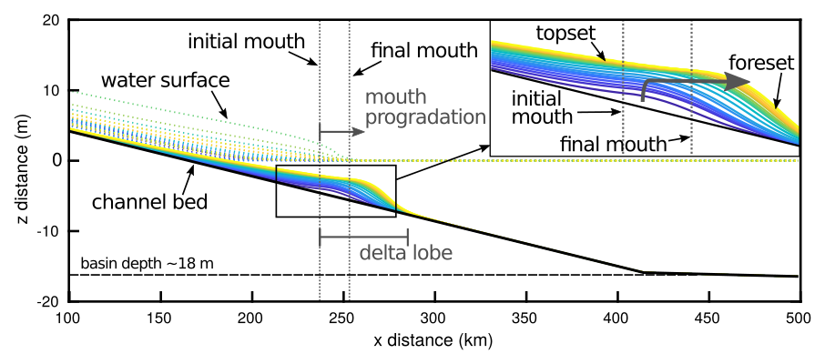
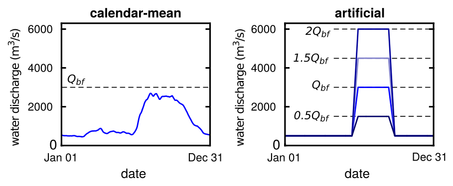

**_NOTE: source code files from this project will be uploaded into this folder when the manuscript has been submitted._**

This file provides documentation to the wrapper used to explore the model develop​ed in "Modeling deltaic lobe-building cycles and avulsions of the Yellow River delta, China" (Moodie et al., in prep). See manuscript for a complete description of the model framework and parameterization. _Documentation for specific portions of the model code is included as line comments throughout the source code._



# 1.0 Wrapper call syntax
A call to the wrapper looks like this:
```
[s] = virtualdelta_wrapper(preAvulThresh, preAvulTrigg, mouSwitch, QwSwitch, QwNum)
```

- `preAvulThresh` is the "setup threshold", or the amount of channel bed aggradation necessary for avulsion. It is normalized to the bankfull flow depth (i.e., fractional).
- `preAvulTrigg` is the "trigger threshold", or the amount of overbank flow necessary for avulsion. It is normalized to the bankfull fow depth (i.e., fractional).
- `mouSwitch` is the control for whether, lobe progradation occurs. See section "Input options" below for available options.
- `QwSwitch` is the control for the water discharge curve used in the model run. See section "Input options" below for available options.
- `QwNum` is the input "shape factor" that impacts the selected water discharge curve in the model. See section "Input options" below for available options.
- `s` is the output storage structure which contains a record of the delta evolution.

To run the model with a setup threshold of 60%, a trigger condition requiring 10% of the flow depth to go overbank, enabled lobe progradation, and a repeating cycle of discharge from the Yellow River use:
```
[s] = virtualdelta_wrapper(0.6, 0.1, 'on', 'mean', NaN)
```

# 2.0 Input options
## 2.1 preAvulThresh
The amount of aggradation of the channel bed required for avulsion (i.e., superelevation). This input can be any numeric greater than zero. The value is normalized to the bankfull flow depth, so a `preAvulThresh` of unity requires aggradation of one complete channel depth before avulsion. Larger values can be used, though the model may become unstable for very large setup thresholds.
## 2.2 preAvulTrigg
The amount of overbank flow required for avulsion. This input can be any numeric greater than zero or NaN to omit the trigger condition requirement. The value is normalized to the bankfull flow depth, so a `preAvulTrigg` of 0.1 necessitates 10% of the flow depth is above the levee for avulsion. The trigger condition primarily serves to eliminate avulsions occurring at very low discharges, and the model result is not particularly sensitive to trigger conditions >0.05.
## 2.3 mouSwitch
The switch to control the development of lobes in the model. Input options are `off` and `on`, which disables and enables lobe progradation, respectively.
## 2.4 QwSwitch
The switch to control the water discharge curve used in the model run. Input options are `con`, `mean`, and `art`. The option `con` produces a curve of constant value where the value is determined by the `QwNum` option which is in units of m3/s. The option `mean` uses a curve designed for the Yellow River simulations which utilizes a repeating cycle of daily-average discharge measurements, averaged over the period 1950-1990 (left in figure below); this option ignores anything in the `QwNum` option. The `art` option produces a repeating artificial curve that mimics a single summer flood season where the `QwNum` option determines the magnitude of the flood in units of m3/s (right in figure below).

## 2.5 QwNum
The control for the magnitude of water discharge curve used in the model. See section 2.4 on `QwSwitch` option for details.

# 3.0 Acknowledgements and disclaimer
The model was created by Andrew J. Moodie as part of an National Science Foundation funded research project assessing the sustainability of anthropogenically influenced deltas.
The research is supported by Grant No. 1427262 and an NSF Graduate Research Fellowship to A.J.M. under Grant No. 1450681.
Any opinion, findings, and conclusions or recommendations expressed in this material are those of the author(s) and do not necessarily reflect the views of the National Science Foundation.
The author(s) guarantee no warranty or technical support for this model.
