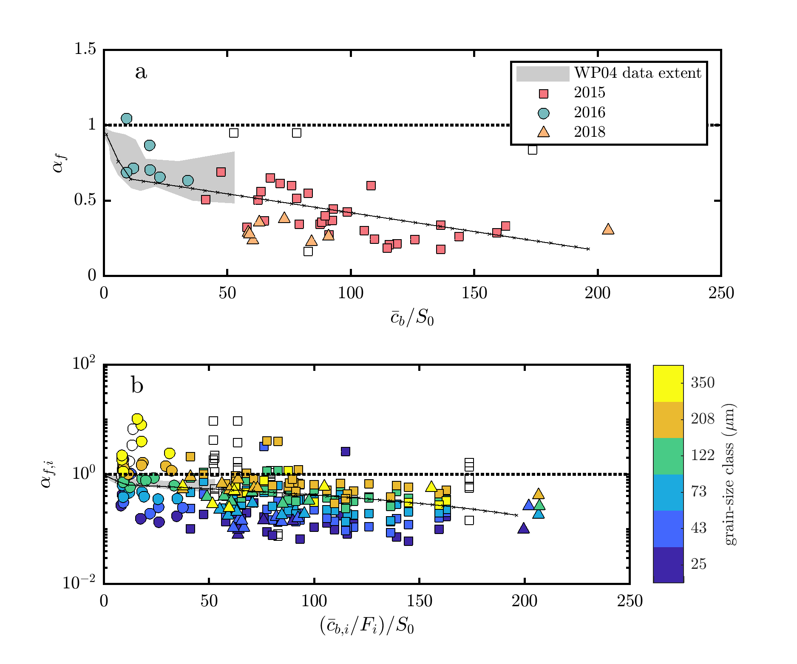

This file documents the source code used in processing and analysis for "Suspended-sediment induced stratification inferred from concentration and velocity profile measurements in the flooding lower Yellow River, China." (Moodie et al., in prep.). 



## Manuscript
The manuscript detailing this analysis is in preparation for WRR:
```
Moodie, Andrew J., Jeffrey A. Nittrouer, Hongbo Ma, Brandee N. Carlson, Yuanjian Wang,
Michael P. Lamb, and Gary Parker (in preparation). "Suspended-sediment induced stratification inferred from concentration and velocity profile measurements in the flooding lower Yellow
River, China." In: Water Resources Research.
```

<!-- A preprint of the manuscript and supplement is available [from EarthArXiv](nolink). -->

## Processing code
The processing code works by operating four files in the following sequence:
1. MakeDataTable.m
2. MakeStratModels.m
3. ExploreDataTable.m
4. MakeSelectedPlots.m


## Data
The data can be found [on Zenodo](https://zenodo.org/record/3457639).
If you use these data, please cite the Zenodo dataset.


## Acknowledgments and disclaimer
The data were generated by Andrew J. Moodie and others as part of an National Science Foundation funded research project assessing the sustainability of anthropogenically influenced deltas.
The research is supported by Grant No. 1427262, and an NSF Graduate Research Fellowship to A.J.M. under Grant No. 1450681.
Any opinion, findings, and conclusions or recommendations expressed in this material are those of the author(s) and do not necessarily reflect the views of the National Science Foundation.
The author(s) guarantee no warranty or technical support for this repository.
