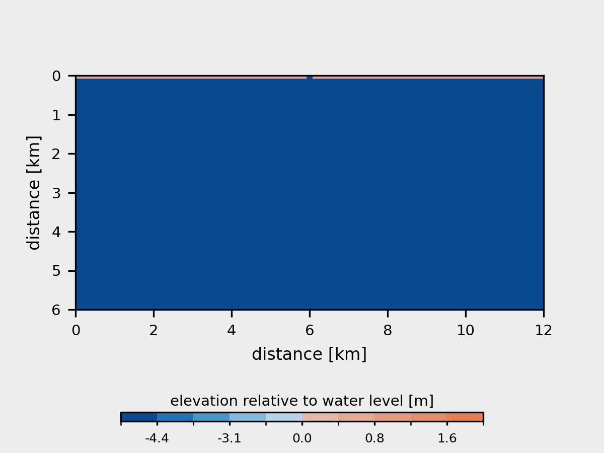

## Manuscript

Moodie, Andrew and Goudge, Timothy. *Fluvial reworking eliminates small craters, but does not meaningfully bias the Mars interbedded-crater record*. Journal of Geophysical Research: Planets. (2025). https://doi.org/10.1029/2023JE008183.

## Delta model
The core numerical delta model is implemented as *pyDeltaRCM* (v2.1.4) and housed in a [separate GitHub repository](https://github.com/DeltaRCM/pyDeltaRCM).
After installing *pyDeltaRCM*, the model runs can be executed with the script in this folder, `model/CraterModel.py`.

The model uses *craterstats* (v3.0.11) to synthesize crater size-frequency distributions, which is housed in a [separate GitHub repository](https://github.com/ggmichael/craterstats).
In the analysis workflow, we use a custom implementation of several tools in *craterstats*, so we bundle our version in a zip folder in the `model` folder. 
The model execution will run with the standard *craterstats* library.

NOTE: to reproduce exact runs, use seed configurations in log files in `data/`.

## Data

* `data/crater_csfd_matrix/` all log and configuration files from simulations with crater populations determined by production function
* `data/crater_uniform_matrix/` all log and configuration files from simulations with crater populations determined by uniform probability distribution
* `data/crater_data/` all data files produced through analysis scripts, including metrics for craters across all simulations, as well as some data from other studies about crater sizes used to make figures
* `data/introduction_figure_inputs` various data used to make plots in Figure 1

## Acknowledgments and disclaimer

The research was supported by a Jackson School of Geosciences Fellowship to Moodie.
The author(s) guarantee no warranty or technical support for the model or analysis codes.
